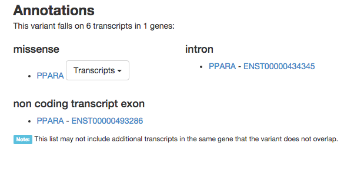

# Interpreting the pathogenicity of coding variants using the ExAC database

#### Fundamentals of Clinical Genetics 

Wellcome Trust Genome Campus, January 2016

[Tarjinder Singh](mailto:ts14@sanger.ac.uk), Jeffrey C. Barrett

## Session description

>Interpreting genetic variation in an individual patient’s genome can only be done in the context of variation in the wider population. Many databases now exist with variation data from thousands of healthy individuals. This session will demonstrate one of the most valuable, the Exome Aggregation Consortium (or ExAC) database of protein-coding variation in 60,000 individuals. Typical use cases will be illustrated, including demonstration of the ExAC website interface. We will also highlight other resources, such as 1000 Genomes and ENSEMBL.

## Interpreting the function of coding variants

Which of many genetic variants in an individual are functional or likely pathogenic?

We can use:

1. coding consequences
    - synonymous, missense, loss-of-function (LoF)

2. gene function
    - e.g. a LoF variant in [_ARID1B_](http://www.omim.org/entry/614556) more likely to be pathogenic than a LoF variant in _OR2T1_

3. allelic frequency in the general population, as a proxy for selective pressure

## Exome Aggregation Consortium (ExAC) - the largest public database of genetic variation to date

- earlier exome sequencing projects: 
    1. [1000 Genomes Project](http://www.1000genomes.org/) (n = 2,504)
    2. [NHLBI ESP project](http://evs.gs.washington.edu/EVS/) (n = 6,503)
    3. [UK10K project](http://www.uk10k.org/) (n = ~5,000)

- ExAC combines all available exomes from global sequencing projects

- describes the functional consequence and allele frequency of each observed coding variant in **60,706** individuals (as of January 2016, v0.3)

- over 10 million variants: one variant every 6 base pairs; most are rare and novel

#### [http://exac.broadinstitute.org/](http://exac.broadinstitute.org/)

## How I can use the [ExAC database](http://exac.broadinstitute.org/)?

- Browse high-quality genetic variants in individual [transcripts](http://exac.broadinstitute.org/transcript/ENST00000407236), [genes](http://exac.broadinstitute.org/awesome?query=PCSK9), and [genomic regions](http://exac.broadinstitute.org/region/22-46615715-46615880)

- Identify the functional consequence, allele frequency, and quality of an [individual variant](http://exac.broadinstitute.org/variant/22-46615880-T-C)

- Find differences in allele frequency of a single variant between [global populations](http://exac.broadinstitute.org/variant/22-46615880-T-C) (African, American, Non-Finnish Europeans, Finnish Europeans, East Asians, South Asians)

- Annotate the variants identified in a patient to prioritise likely pathogenic variants

## Genes likely intolerant of damaging mutations

- calculated from how depleted the gene is of damaging variants compared to expectation given the gene's mutation rate 

- measured by **pLI**
    - a score from 0 - 1
    - genes with pLI > 0.9 described as under genic constraint
    - a proxy for if a single copy loss of a gene is selected against in the population

- [_CHD8_](http://exac.broadinstitute.org/gene/ENSG00000100888) has a pLI of 1, and when disrupted, is highly penetrant for developmental disorders

- [_OR2T1_](http://exac.broadinstitute.org/gene/ENSG00000175143) has a pLI of 0, is an olfactory receptor, and a single-copy loss is unlikely to cause a severe phenotype

## How to use ExAC

- for individual queries, access online browser at [http://exac.broadinstitute.org/](http://exac.broadinstitute.org/)

- first, type in:
    - gene symbols (e.g. _PCSK9_)
    - Ensembl or RefSeq transcript IDs (e.g. ENST00000407236)
    - rs IDs (rs1800234)
    - variant positions (22-46615880)
    - region of interest (22:46615715-46615880)

- in the gene, transcript, and region view, we see:
    
**Top left**: gene name, number of variants, and link to other online resources and references

**Top right**: observed and expected number of variants of each functional class, and the pLI score

**Middle**: Exonic coverage for gene or transcript (proxy for regional quality)

**Below**: Table of all variants observed in this gene

- for each variant, the chromosome, position, consequence, annotation, allele frequency is provided 

- can filter by consequence (Missense + LoF, or LoF)

- in the variant view, we see:
    
**Top left**: ID, frequency, and link to other online resources

**Top right**: quality metrics

**Middle left**: Functional consequence, and link to gene and transcript

**Middle right**: Frequencies in different global populations

**Bottom**: Read-level data, for a low-level evaluation of quality

#### Quick examples

- [rs334](http://exac.broadinstitute.org/variant/11-5248232-T-A), the causal variant in sickle cell anemia
    - note the differences in allele frequency between populations

- [p.Phe508del](http://exac.broadinstitute.org/variant/7-117199644-ATCT-A) in CFTR, the causal variant in cystic fibrosis
    - again, note the differences in allele frequency
    - because cystic fibrosis is recessive (no dominant mode), the pLI for _CFTR_ is 0

- [KMT2A](http://exac.broadinstitute.org/gene/ENSG00000118058), a gene when disrupted causes Wiedenmann-Steiner syndrome
    - there are only 4 LoF variants in >60,000 individuals
    - highly constrained gene (pLI = 1)

#### Demo

For the following genes (_TP53_, _ARID1B_, _NOD2_, _NRXN1_):

1. Determine the number of LoF variants in the canonical transcript

2. Find the pLI score and determine if the gene is constrained

3. Find the number of transcripts

4. For the first missense variant in the gene, find the allele frequency in Non-Finnish Europeans 

5. Identify any exons not well-covered by the exome capture technology

## Ensembl VEP for annotating large numbers of variants

- we can use the Ensembl VEP tool to annotate a large number of variants (for example, all variants in a single patient)

- can use a number of input formats, but the most common is the VCF format

### [http://www.ensembl.org/common/Tools/VEP](http://www.ensembl.org/common/Tools/VEP)

#### Demo

1. For variants encoded in GRCh37, [go here](http://grch37.ensembl.org/Homo_sapiens/Tools/VEP)

2. Paste the following into "Either paste data:":

    >12 49416554 . G GA . . .  
    >18 53070914 . G A . . .  
    >22 36142530 . AAGCGGCTGC A . . . 

    

    Alternatively, you can upload a VCF to the website. 

3. Under **Identifiers and frequency data**, go to **Frequency data for co-located variants**, and select **ExAC allele frequencies**

    

4. Click Run and wait. Click view results. 

Answer the following questions:

- What are the allele frequencies of each variant in ExAC?

- If the three variants are observed in the same patient, which variant is most likely to be diagnostic? Use constraint scores on the ExAC website as support. 

## Things to be aware of

- ExAC is not a collection of phenotypically healthy individuals and includes individuals with schizophrenia, inflammatory bowel disease, diabetes etc. (see [here](http://exac.broadinstitute.org/about) for more information)
    - for rare or severe developmental disorders, this should be less of an issue

- some regions without genetic variants are simply not well covered in earlier exome captures, so note the coverage!

- ExAC is still in development, so changes in some variants might be observed

## More information

- [About ExAC](http://exac.broadinstitute.org/about)

- [Download page for the raw ExAC data](http://exac.broadinstitute.org/downloads)

- [ExAC manuscript preprint](http://biorxiv.org/content/early/2015/10/30/030338)

- [Short blog post on how to use ExAC](http://wp.sanger.ac.uk/barrettgroup/2015/03/20/exac-its-big-and-easy-to-use/)

